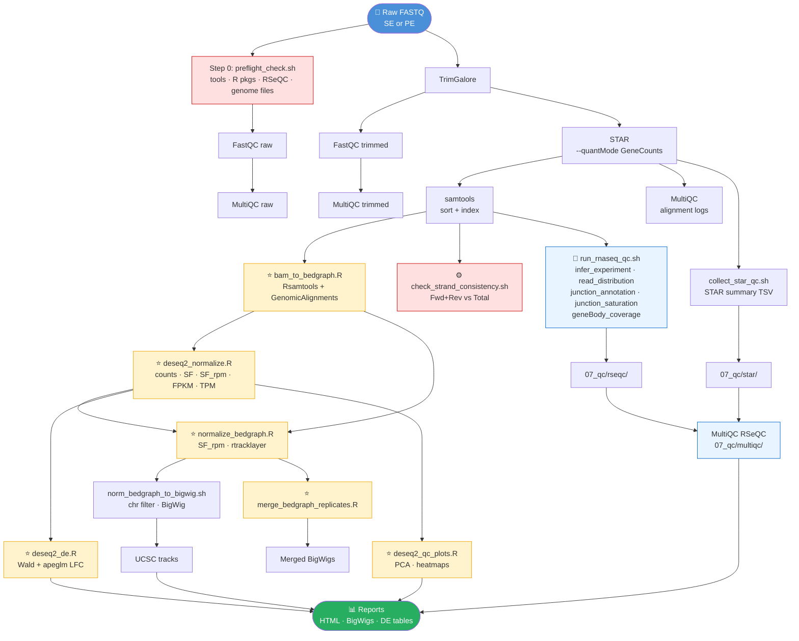

<p align="center">
  <h1 align="center">rnaseq2tracks</h1>
  <p align="center">End-to-end RNA-seq: raw FASTQ → counts → normalized BigWigs → differential expression</p>
  <p align="center">
    
    
    
    
    
    
    
    
  </p>
</p>

---

## Workflow



> ⭐ R &nbsp;|&nbsp; ⚙️ sanity check &nbsp;|&nbsp; 🔬 RSeQC &nbsp;|&nbsp; other = Bash

---

## Features

- **SE and PE** support; choice set in `config.conf`
- **Human and mouse** in one config — switch with `SPECIES=`
- **Strand-aware BigWig tracks** (forward / reverse) or unstranded
- **UCSC-compatible BigWigs** — canonical chromosomes only (UCSC or Ensembl naming)
- **Preflight check** — validates tools, R packages, RSeQC binaries, BED file, genome paths
- **STAR alignment summary TSV** from Log.final.out — included in MultiQC
- **RSeQC QC module** — infer_experiment, read_distribution, junction_annotation, junction_saturation, geneBody_coverage; integrated into MultiQC
- **Strand consistency sanity check** — hard fail if Fwd+Rev diverges from Total > tolerance
- **DESeq2 SF_rpm normalization** (size factor × mean-RPM anchor)
- **DESeq2 DE** — Wald + apeglm LFC shrinkage per contrast
- **Replicate merging** — GRanges disjoin mean BigWigs
- **HTML pipeline report** — STAR summary, size factors, infer_experiment table, output index
- **Executable smoke test** — 7 checks before full run

---

## Quick start

```bash
git clone https://github.com/MichalGd/rnaseq2tracks.git && cd rnaseq2tracks
conda env create -f environment.yml && conda activate rnaseq2tracks

cp config/config_template.conf  config/config.conf   # fill all paths
cp config/samplesheet_template_PE.csv config/samplesheet.csv
cp config/contrasts_template.csv config/contrasts.csv

bash tests/run_smoke_test.sh config/config.conf      # pre-flight
./scripts/rnaseq2tracks.sh   config/config.conf
```

---

## Input FASTQ naming (PE)

```
KO_12_1_1__ERR14875937_1.fq.gz   ← R1
KO_12_1_2__ERR14875937_2.fq.gz   ← R2
```
`sample_id = KO_12_1` in samplesheet.

---

## Samplesheet columns

| Column | PE | SE | Values |
|--------|----|----|--------|
| `sample_id` | ✓ | ✓ | unique, no spaces |
| `fastq_R1` | ✓ | ✓ | absolute path |
| `fastq_R2` | ✓ | — | absolute path |
| `condition` | ✓ | ✓ | `KO`, `WT`, … |
| `replicate` | ✓ | ✓ | `1`, `2`, `3` … |
| `strandedness` | ✓ | ✓ | `unstranded` / `forward` / `reverse` |

---

## Strandedness

| Value | STAR col | Library type |
|-------|---------|-------------|
| `unstranded` | 2 | Non-stranded |
| `forward` | 3 | Read 1 on RNA strand |
| `reverse` | 4 | dUTP / NEBNext Ultra II / TruSeq Stranded |

Run `infer_experiment.py` output (in `07_qc/rseqc/infer_experiment/`) to validate.

---

## Output tree

```
<OUTDIR>/
├── 07_qc/
│   ├── star/               STAR Log.final.out symlinks + summary TSV
│   ├── rseqc/              infer_experiment · read_distribution
│   │                       junction_annotation · junction_saturation · genebody
│   └── multiqc/            multiQC_rseqc.html
├── analysis/
│   ├── counts/             raw_counts.tsv · normalized_counts.tsv · size_factors.tsv · dds.RData
│   ├── DE/                 DE tables · volcano plots
│   └── figures/            PCA · clustering · heatmaps
├── bigwig/                 per-sample Fwd/Rev + merged BigWigs
├── multiQC/                raw · trimmed · alignments · final
└── reports/
    ├── pipeline_report.html
    └── ucsc_tracks.txt
```

---

## Key new config variables (v4)

```bash
RSEQC_BED_MOUSE="/path/to/mm39_GENCODE_vM31.bed"
RSEQC_BED_HUMAN="/path/to/hg38_GENCODE_V45.bed"
RSEQC_BIN_DIR=""        # empty = use PATH
RUN_RSEQC="true"
STRAND_TOLERANCE_PCT="5"
```

---

## Documentation

| File | Contents |
|------|---------|
| [RSEQC.md](docs/RSEQC.md) | Module descriptions, BED files, metric interpretation |
| [WORKFLOW.md](docs/WORKFLOW.md) | Full step table |
| [SCRIPTS.md](docs/SCRIPTS.md) | Origin tags for every file |
| [INSTALLATION.md](docs/INSTALLATION.md) | Conda, STAR index, BED generation |
| [USAGE.md](docs/USAGE.md) | Config reference, post-run |
| [OUTPUTS.md](docs/OUTPUTS.md) | Full output tree with column docs |
| [KNOWN_ISSUES.md](docs/KNOWN_ISSUES.md) | STAR shared memory, apeglm, gzip |
| [GITHUB_UPLOAD.md](docs/GITHUB_UPLOAD.md) | 3-command upload + tagging |

---

## Citation

See [`CITATION.cff`](CITATION.cff)

## License

MIT © Michal Gdula
