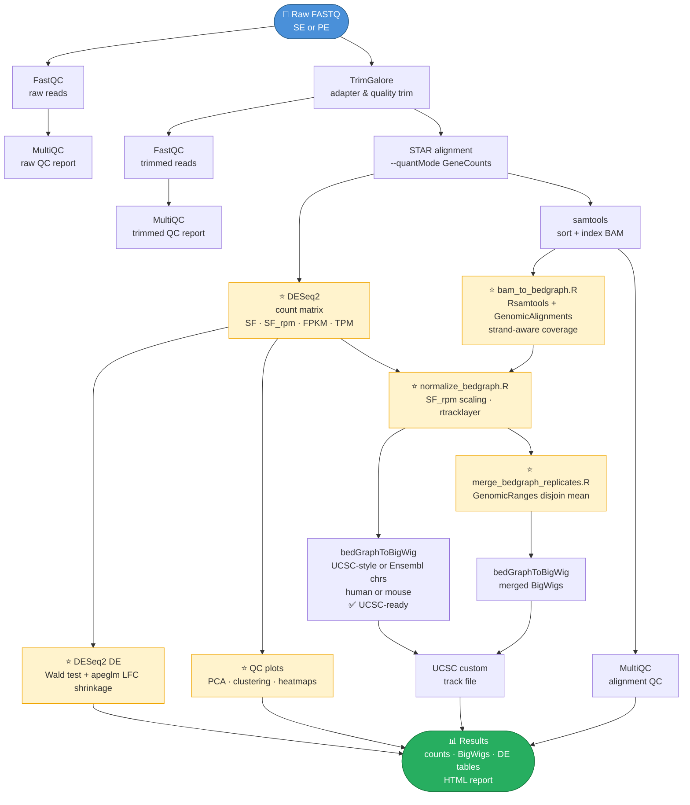

<p align="center">
  <h1 align="center">rnaseq2tracks</h1>
  <p align="center">
    End-to-end RNA-seq pipeline: raw FASTQ → count matrices → normalized BigWig tracks → differential expression
  </p>
  <p align="center">
    
    
    
    
    
    
    
    
  </p>
</p>

---

## Workflow overview



> ⭐ = implemented in **R** &nbsp;|&nbsp; All other steps: **Bash** shell

---

## Features

- **Single-end and paired-end** support — set one parameter in config
- **Human and mouse** — one config file holds paths for both; switch with `SPECIES=human|mouse`
- **Strand-aware BigWig tracks** — forward and reverse strand per sample
- **UCSC-compatible BigWigs** — configurable chromosome filter: UCSC (`chr1…chrM`) or Ensembl (`1…MT`) naming; escape hatch `REGULAR_CHROMS_ONLY=false` for custom genomes
- **DESeq2 SF_rpm normalization** — size-factor anchored to mean RPM; publication-ready scale
- **Differential expression** — Wald test + apeglm LFC shrinkage, volcano and MA plots per contrast
- **Replicate merging** — optional averaged BigWigs per condition for cleaner visualization
- **Full QC** — FastQC + MultiQC at three stages; PCA, sample clustering, top-50 heatmaps
- **Reproducibility** — `sessionInfo.txt` written by every R module
- **HTML pipeline report** — kableExtra tables + SF_rpm bar chart; self-contained
- **Executable smoke test** — checks tool availability, R packages, config, samplesheet before running

---

## Quick start

```bash
# 1. Clone
git clone https://github.com/MichalGd/rnaseq2tracks.git
cd rnaseq2tracks

# 2. Environment
conda env create -f environment.yml
conda activate rnaseq2tracks

# 3. Configure
cp config/config_template.conf  config/config.conf    # fill in paths
cp config/samplesheet_template_PE.csv config/samplesheet.csv
cp config/contrasts_template.csv config/contrasts.csv

# 4. Smoke test (optional but recommended)
bash tests/run_smoke_test.sh config/config.conf

# 5. Run
./scripts/rnaseq2tracks.sh config/config.conf
```

---

## Input FASTQ naming

Paired-end (supported format):
```
KO_12_1_1__ERR14875937_1.fq.gz   ← R1
KO_12_1_2__ERR14875937_2.fq.gz   ← R2
```
Set `sample_id=KO_12_1` in the samplesheet. TrimGalore `--basename` handles renaming automatically.

---

## Samplesheet

| Column | PE | SE | Values |
|---|---|---|---|
| `sample_id` | ✓ | ✓ | unique, no spaces |
| `fastq_R1` | ✓ | ✓ | absolute path |
| `fastq_R2` | ✓ | — | absolute path |
| `condition` | ✓ | ✓ | e.g. `KO`, `WT` |
| `replicate` | ✓ | ✓ | `1`, `2`, `3` … |
| `strandedness` | ✓ | ✓ | `unstranded` / `forward` / `reverse` |

Mixed strandedness across samples is supported — the `strandedness` column is per-sample.

---

## Strandedness guide

| Value | STAR column | Typical library |
|---|---|---|
| `unstranded` | 2 | Standard non-stranded |
| `forward` | 3 | 1st read on RNA strand |
| `reverse` | 4 | 2nd read on RNA strand *(NEBNext Ultra II, TruSeq Stranded, dUTP)* |

---

## Chromosome filter options (v3)

| Parameter | Values | Effect |
|---|---|---|
| `SPECIES` | `human` \| `mouse` | Selects correct genome paths; drives chr filter |
| `CHROMOSOME_NAMING` | `ucsc` \| `ensembl` | `chr1…chrM` vs `1…MT` |
| `REGULAR_CHROMS_ONLY` | `true` \| `false` | Filter on/off; `false` = keep all scaffolds |

When filtering is `true`, the full-genome bedGraph is kept as `<stem>.all_chromosomes.bedGraph.gz` alongside the filtered BigWig for debugging.

---

## Outputs

```
<OUTDIR>/
├── analysis/
│   ├── counts/          raw_counts · normalized_counts · fpkm · tpm · size_factors · dds.RData
│   ├── DE/              <contrast>_DE_results.tsv · volcano.pdf · MA_plot.pdf
│   └── figures/         PCA.pdf · sample_clustering.pdf · top50_heatmap.pdf
├── bigwig/
│   ├── <sample>_FwdS.bw                per-sample forward
│   ├── <sample>_RevS.bw                per-sample reverse
│   ├── <condition>_Fwd_mergedS.bw      merged  (if MERGE_REPLICATES=true)
│   └── <condition>_Rev_mergedS.bw
├── multiQC/             raw · trimmed · alignments · final
└── reports/
    ├── pipeline_report.html
    └── ucsc_tracks.txt
```

---

## Key configuration variables

```bash
SPECIES="mouse"               # human | mouse — drives all genome path selection
CHROMOSOME_NAMING="ucsc"      # ucsc | ensembl
REGULAR_CHROMS_ONLY="true"    # true | false

# Human paths
STAR_INDEX_HUMAN=""; GTF_HUMAN=""; CHROM_SIZES_HUMAN=""
# Mouse paths
STAR_INDEX_MOUSE=""; GTF_MOUSE=""; CHROM_SIZES_MOUSE=""

LIBRARY_LAYOUT="PE"           # SE | PE
MERGE_REPLICATES="true"
RUN_DE="true"
```

Full template: [`config/config_template.conf`](config/config_template.conf)

---

## Language map

| Step | Language | Why |
|---|---|---|
| Orchestration, STAR, samtools, TrimGalore, FastQC, MultiQC | **Bash** | Shell-native tools; PID job throttling idiomatic |
| Strand-aware coverage | **R** — Rsamtools + GenomicAlignments + rtracklayer | No split-BAMs; correct PE orientation |
| bedGraph normalization | **R** — rtracklayer | Type-safe GRanges import/export |
| Count matrix + normalization | **R** — DESeq2 | Native |
| Replicate merging | **R** — GenomicRanges | Exact `disjoin` + mean score logic |
| Differential expression | **R** — DESeq2 + apeglm | Native |
| QC plots | **R** — ggplot2, pheatmap | Native |
| Report | **R Markdown** | kableExtra + ggplot2 |
| BigWig conversion | **Bash** — Kent utils | No R equivalent |

---

## Documentation

| Doc | Contents |
|---|---|
| [WORKFLOW.md](docs/WORKFLOW.md) | Step table, strandedness guide, chr filter guide |
| [SCRIPTS.md](docs/SCRIPTS.md) | Per-script origin, language rationale |
| [INSTALLATION.md](docs/INSTALLATION.md) | Conda, STAR index, chrom.sizes |
| [USAGE.md](docs/USAGE.md) | Config reference, post-run commands |
| [OUTPUTS.md](docs/OUTPUTS.md) | Full output tree with column descriptions |
| [KNOWN_ISSUES.md](docs/KNOWN_ISSUES.md) | Memory, STAR shared mem, apeglm, pandoc |
| [GITHUB_UPLOAD.md](docs/GITHUB_UPLOAD.md) | Git Bash upload + versioning |

---

## Citation

If you use this pipeline, please cite it using the information in [`CITATION.cff`](CITATION.cff).

---

## License

MIT © Michal Gdula — see [`LICENSE`](LICENSE)
