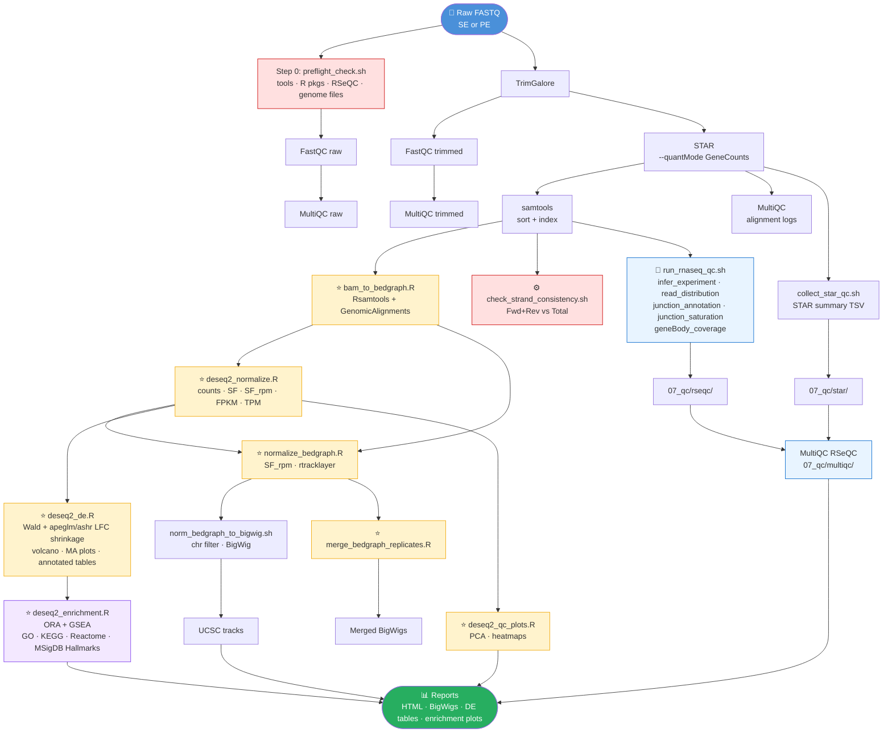

<p align="center">
  <h1 align="center">rnaseq2tracks</h1>
  <p align="center">End-to-end RNA-seq: raw FASTQ → counts → normalized BigWigs → differential expression → gene set enrichment</p>
  <p align="center">
    
    
    
    
    
    
    
    
    
  </p>
</p>

---

## Workflow



> ⭐ R &nbsp;|&nbsp; ⚙️ sanity check &nbsp;|&nbsp; 🔬 RSeQC &nbsp;|&nbsp; other = Bash

---

## Features

- **SE and PE** support; choice set in `config.conf`
- **Human and mouse** in one config — switch with `SPECIES=`
- **Strand-aware BigWig tracks** (forward / reverse) or unstranded
- **UCSC-compatible BigWigs** — canonical chromosomes only (UCSC or Ensembl naming)
- **Preflight check** — validates tools, R packages, RSeQC binaries, BED file, and genome paths before the run starts
- **STAR alignment summary TSV** from `Log.final.out` — included in MultiQC
- **RSeQC QC module** — infer_experiment, read_distribution, junction_annotation, junction_saturation, geneBody_coverage; integrated into MultiQC
- **Strand consistency check** — hard fail if Fwd+Rev diverges from Total by more than the configured tolerance
- **DESeq2 SF_rpm normalization** (size factor × mean-RPM anchor)
- **DESeq2 DE** — Wald test with apeglm LFC shrinkage (ashr fallback); unshrunken and shrunken volcano and MA plots; annotated count tables
- **Gene set enrichment analysis** (Step 21) — ORA and GSEA across GO BP/MF/CC, KEGG, Reactome, and MSigDB Hallmarks; per-contrast TSV tables and PDF/PNG plots
- **Replicate merging** — GRanges disjoin mean BigWigs
- **HTML pipeline report** — STAR summary, size factors, infer_experiment table, output index
- **Executable smoke test** — pre-flight checks before the full run

---

## Quick start

```bash
git clone https://github.com/MichalGd/rnaseq2tracksP.git && cd rnaseq2tracksP
conda env create -f environment.yml && conda activate rnaseq2tracks

cp config/config_template.conf  config/config.conf   # fill all paths
cp config/samplesheet_template_PE.csv config/samplesheet.csv
cp config/contrasts_template.csv config/contrasts.csv

bash tests/run_smoke_test.sh config/config.conf      # pre-flight check
./scripts/rnaseq2tracks.sh   config/config.conf
```

---

## Input FASTQ naming (PE)

```
KO_12_1_1__ERR14875937_1.fq.gz   ← R1
KO_12_1_2__ERR14875937_2.fq.gz   ← R2
```

`sample_id = KO_12_1` in samplesheet.

---

## Samplesheet columns

| Column | PE | SE | Values |
|--------|----|----|--------|
| `sample_id` | ✓ | ✓ | unique identifier, no spaces |
| `fastq_R1` | ✓ | ✓ | absolute path to R1 (or only) FASTQ |
| `fastq_R2` | ✓ | — | absolute path to R2 FASTQ |
| `condition` | ✓ | ✓ | group label used in DESeq2 design |
| `replicate` | ✓ | ✓ | integer replicate number |
| `strandedness` | ✓ | ✓ | `forward`, `reverse`, or `unstranded` |

See `examples/samplesheet_example_PE.csv` and `examples/samplesheet_example_SE.csv`.

---

## Contrasts file

```csv
contrast_id,numerator,denominator
KO_vs_WT,KO,WT
```

- `contrast_id` — used as a file name prefix for all DE and enrichment outputs
- `numerator` — condition label for the numerator (treatment)
- `denominator` — condition label for the denominator (reference)

See `examples/contrasts_example.csv`.

---

## Key configuration parameters

| Parameter | Default | Description |
|-----------|---------|-------------|
| `SPECIES` | — | `human` or `mouse` |
| `LIBRARY_LAYOUT` | — | `SE` or `PE` |
| `DE_LFC_THRESHOLD` | `1` | \|log2FC\| threshold for DE calling |
| `DE_PADJ_THRESHOLD` | `0.05` | adjusted p-value threshold for DE calling |
| `LFC_THRESHOLD` | `1` | \|log2FC\| threshold for ORA gene list in enrichment |
| `PADJ_THRESHOLD` | `0.05` | adjusted p-value threshold for ORA gene list in enrichment |
| `ENRICHMENT_MINGS` | `10` | minimum gene set size for enrichment |
| `ENRICHMENT_MAXGS` | `500` | maximum gene set size for enrichment |
| `MAX_JOBS` | `8` | maximum parallel background jobs |
| `FORCE_RERUN` | `0` | set to `1` to force rerun of completed steps |

Full parameter reference: `config/config_template.conf`.

---

## Gene set enrichment analysis (Step 21)

Step 21 runs after differential expression (Step 16) and uses the DE results as input.

**Input:** `analysis/DE/<contrast_id>_DE_results.tsv` — shrunken LFC results from `deseq2_de.R`

**Methods:**
- **ORA** (Over-Representation Analysis) — tests whether significantly DE genes (filtered by `PADJ_THRESHOLD` and `LFC_THRESHOLD`) are enriched in a gene set, using the full expressed gene list as background
- **GSEA** (Gene Set Enrichment Analysis) — uses all expressed genes ranked by `sign(LFC) × −log10(padj)`, which is robust to LFC shrinkage and avoids tied rankings

**Databases covered:**
| Database | ORA | GSEA |
|----------|-----|------|
| GO Biological Process | ✓ | ✓ |
| GO Molecular Function | ✓ | ✓ |
| GO Cellular Component | ✓ | — |
| KEGG | ✓ | ✓ |
| Reactome | ✓ | ✓ |
| MSigDB Hallmarks | — | ✓ (via fgsea) |

**Output:** `analysis/enrichment/<contrast_id>/`
- `<contrast_id>_ORA_<DB>.tsv` — ORA result table
- `<contrast_id>_GSEA_<DB>.tsv` — GSEA result table
- `<contrast_id>_ORA_<DB>_dotplot.pdf/.png` — dot plot
- `<contrast_id>_ORA_<DB>_barplot.pdf/.png` — bar plot
- `<contrast_id>_ORA_<DB>_cnetplot.pdf/.png` — concept network plot (ORA only)
- `<contrast_id>_GSEA_Hallmarks_barplot.pdf/.png` — NES bar plot for significant Hallmarks

Completion is tracked by `analysis/enrichment/.enrichment_done`. Delete this file to rerun Step 21 without rerunning the full pipeline.

---

## Output directory structure

```
<OUTDIR>/
├── fastQC/          raw and trimmed FastQC reports
├── multiQC/         MultiQC reports (raw, trimmed, alignments, final)
├── trimmedFastq/    TrimGalore output
├── STARalignments/  raw BAM files from STAR
├── STARlogs/        STAR Log.final.out files
├── STARgeneCounts/  STAR gene count tables
├── bams/            sorted and indexed BAM files
├── bedGraph/
│   ├── raw/         per-sample raw bedGraphs
│   ├── normalized/  per-sample SF_rpm-normalized bedGraphs
│   └── merged/      per-condition merged bedGraphs
├── bigwig/          per-sample and per-condition BigWig files
├── 07_qc/
│   ├── star/        STAR alignment summary TSV
│   ├── rseqc/       RSeQC outputs per sample
│   └── multiqc/     RSeQC MultiQC report
├── analysis/
│   ├── counts/      dds.RData, raw_counts.tsv, normalized_counts.tsv, size_factors.tsv
│   ├── DE/          per-contrast DE results TSV, significant TSV, volcano and MA plots
│   ├── tables/      per-contrast annotated count tables (gene annotation + counts + DE)
│   ├── figures/     PCA, sample clustering, heatmaps
│   └── enrichment/  per-contrast ORA and GSEA results (TSV tables and plots)
└── reports/         HTML pipeline report, UCSC track hub file
```

---

## Rerunning individual steps

Steps use sentinel files to skip completed work. To rerun specific steps without rerunning the full pipeline:

```bash
# Rerun DE (Step 16) and enrichment (Step 21) only
rm -f analysis/DE/*_DE_results.tsv
rm -f analysis/enrichment/.enrichment_done

DE_LFC_THRESHOLD=0 DE_PADJ_THRESHOLD=0.05 \
PADJ_THRESHOLD=0.05 LFC_THRESHOLD=0 \
./scripts/rnaseq2tracks.sh config/config.conf

# Force rerun of all steps
FORCE_RERUN=1 ./scripts/rnaseq2tracks.sh config/config.conf
```

---

## Requirements

All dependencies are managed via conda:

```bash
conda env create -f environment.yml
conda activate rnaseq2tracks
```

Additionally required (not available via conda):
- **UCSC kentutils** — `bedGraphToBigWig`; set `KENTUTILS_DIR` in `config.conf`
- **Genome files** — STAR index, GTF, chrom.sizes, RSeQC BED12; paths set in `config.conf`

See `docs/INSTALLATION.md` for detailed setup instructions.

---

## Documentation

| Document | Description |
|----------|-------------|
| `docs/INSTALLATION.md` | Conda setup, genome file preparation, RSeQC BED generation |
| `docs/USAGE.md` | Detailed usage, config parameters, and rerun instructions |
| `docs/OUTPUTS.md` | Full description of all output files and directories |
| `docs/WORKFLOW.md` | Step-by-step pipeline description |
| `docs/RSEQC.md` | RSeQC module documentation and metric interpretation |
| `docs/SCRIPTS.md` | Description of all scripts and R modules |

---

## Citation

If you use this pipeline, please cite:

```
Gdula, M. (2026). rnaseq2tracks (v5.0). GitHub. https://github.com/MichalGd/rnaseq2tracksP
```

See `CITATION.cff` for full citation metadata.

The enrichment analysis module uses the following tools — please cite them in published work:
- **clusterProfiler**: Wu et al. (2021) *The Innovation* 2(3):100141
- **ReactomePA**: Yu & He (2016) *Mol BioSyst* 12(2):477–479
- **fgsea**: Korotkevich et al. (2021) *bioRxiv*
- **DESeq2**: Love et al. (2014) *Genome Biology* 15:550
- **ashr** (LFC shrinkage fallback): Stephens (2016) *Biostatistics* 18(2)

---

## License

MIT — see `LICENSE`.
